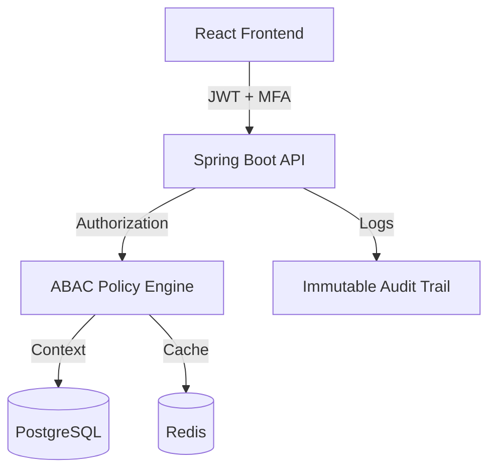

# MedShare Hub

> **Project 2026**: A Next-Generation Secure Healthcare Data Exchange Platform

MedShare Hub is a comprehensive healthcare interoperability platform built with a focus on core security, granular authorization (ABAC), and patient-centric data control. It enables secure sharing of medical records while ensuring strict compliance with HIPAA and other international data protection standards.

## 🏗 Architecture Overview

The system follows a modern decoupled architecture:

### Core Components

- **[Backend (Spring Boot)](./backend)**: High-performance Java API with custom ABAC engine, JWT security, and HIPAA auditing.
- **[Frontend (React)](./frontend)**: Accessible (WCAG 2.1 AA), responsive interface for providers and patients.
- **ABAC Engine**: Attribute-Based Access Control system that evaluates complex policies in real-time (<100ms).

## 🚀 Key Features

| Feature | Description |
| :--- | :--- |
| **ABAC Authorization** | Fine-grained access control based on Subject, Resource, and Environment attributes. |
| **Emergency Access** | "Break-glass" protocols for immediate record access in life-threatening situations with mandatory auditing. |
| **Multi-Factor Auth** | Enhanced security for all accounts using TOTP-based verification. |
| **Consent Management** | Patients can grant, revoke, and delegate access to their health data. |
| **Anomaly Detection** | Real-time monitoring for suspicious access patterns and unauthorized attempts. |
| **Secure Messaging** | Internal secure communication channel for clinical coordination. |

## 🛠 Tech Stack

- **Backend**: Java 17, Spring Boot 3.x, Spring Security, Hibernate, Flyway.
- **Frontend**: React 18, TypeScript, Vite, Material-UI, Redux Toolkit.
- **Database**: PostgreSQL 15, Redis 7.
- **Compliance**: HIPAA-aligned audit trails and field-level redaction.

## 📁 Repository Structure

- `/backend`: Spring Boot application source code and documentation.
- `/frontend`: React application source code and documentation.
- `/.gemini`: Project-specific AI agent instructions and task tracking.

## 🏁 Getting Started

To get the entire system running, please follow the detailed setup instructions in each sub-directory:

1.  **[Backend Setup Guide](./backend/README.md#quick-start)**
2.  **[Frontend Setup Guide](./frontend/README.md#setup--running)**

## 🛡 Security & Ethics

MedShare Hub is designed with **Privacy by Design** principles:
- **Zero Trust**: Every request is authenticated and authorized via ABAC.
- **Minimalism**: Only the data required for the specific task is exposed (field-level filtering).
- **Transparency**: Patients have full visibility into who accessed their data and why.

---
© 2026 MedShare Hub Project Team
